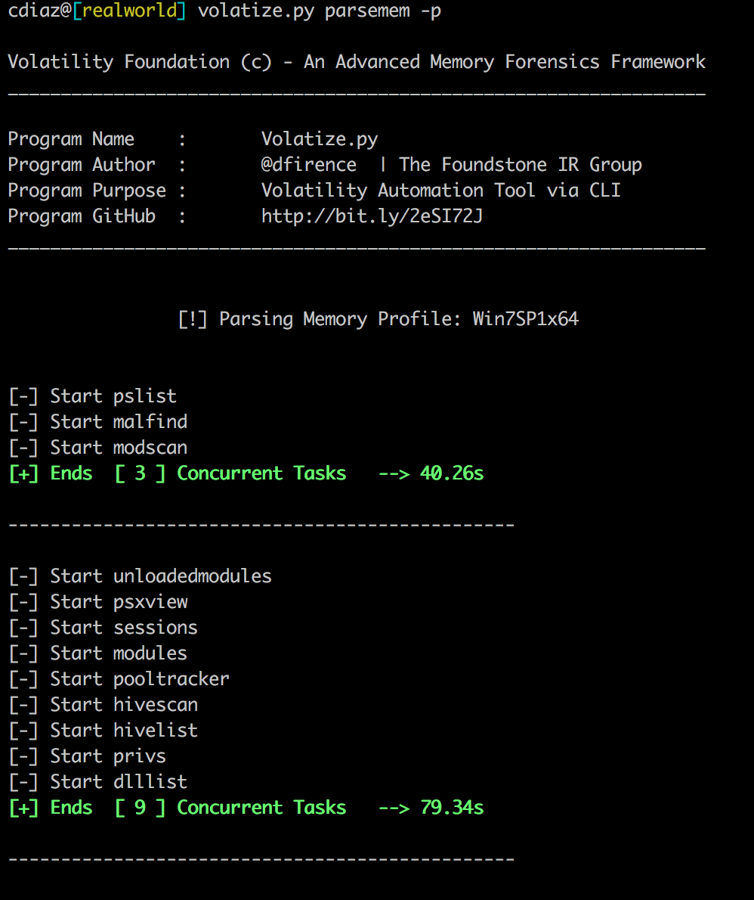
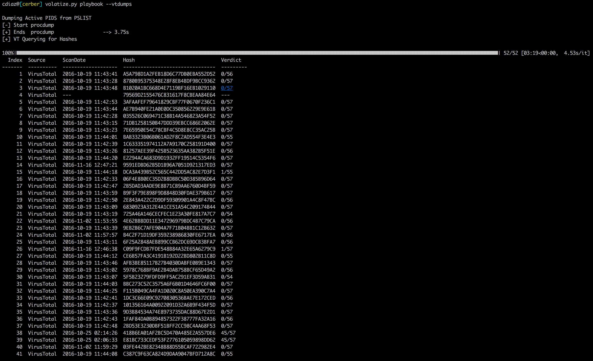

# demos
Prototype Demo Code for security community

# Volatize.py
An automation tool for the Volatility Memory Forensics Framework. Focused on analysis productivity.
Current DEMO CODE works on Python 2.7.x

______________________________________________________________________
 Volatility Foundation (c) - An advanced  memory forensics framework
______________________________________________________________________

 Volatize.py By The Foundstone IR Group - Volatility Automation Tool

	     Demo Version: For Security practitioners
_____________________________________________________________________

# Dependencies
You need the following packages installed to use Volatize
- requests  : pip install requests
- tabulate  : pip install tabulate
- futures   : pip install futures
- tqdm      : pip install tqdm
- colorama  : pip install colorama
- Volatility

# Configuration Needed
To have a clean experience of Volatize, we have to make a small modification to the Volatility application (i.e., vol.py)

1. Find your Volatility main script.  Mine is located under /usr/local/bin/vol.py
>>> $ which vol.py

2. Use an editor to edit LINE # 139 of vol.py by placing a pound symbol in front.  Should look like this:
>>> Line 139:  #sys.stderr.write("Volatility Foundation Volatility Framework {0}\n".format(constants.VERSION))

3. ( Optional ), if you do not have a symbolic link of Volatility, create one like this:
>>> $ sudo ln -s /path/of/volatility /usr/local/bin/vol.py
________________________________________________________________________
*** Note:  Volatize calls vol.py as "vol.py"
	   You need to ensure Volatility is accessed globally
	   as " vol.py "
________________________________________________________________________

# Why Volatize
Intended to maximize productivity when analyzing memdumps.  I saved 71 minutes of just typing and waiting for output from the plugins I would run. Also, the concept of playbooks left unattended as visio diagrams and hard to manage scripts are an ineffective way to lead robust security operations. The usage of Volatize is intended to fix this by digitizing your visios, processes, or notes into a digital playbook for memory forensics.  

All tactical teams benefit by trying to digitize the playbooks they have within their orgs with tools like Volatize.  If you do not have the in-house expertise, reach out to me (us) and we will gladly help add your playbooks to the tool.  

# Are there other tools already?
While many great researchers are developing Flask, Django or other forms of automated tools, I am focusing on lightweight CLI workflows. 

Kudos to the authors of such tools like vortessence, volutility, volatility-bot, etc.!

# How to access the Help Menu?
>>> $ volatize.py --help

>>> $ volatize.py parsemem --help

>>> $ volatize.py playbook --help

# How To Run the Parse Memory mode?

- You can run an automatic mode with the 'parsemem' mode:

>>> $ volatize.py parsemem --auto --memory "path/to/memory/sample"

Or if you just want to setup the case structure to parse memory:

>>> $ volatize.py parsemem --setup --memory "path/to/memory/sample"

This mode runs a series of Volatility plugins specific to the Windows Memory profile you have.

# How To Run the Playbook mode?
In Volatize, playbooks are ideas translated to script code that create a digitized playbook.  You can find the playbook scripts under the "playbook" folder.

- You can run a playbook script by using the "playbook" mode:

>>> $ volatize.py playbook < name of script >

# How to Run VTDUMPS.PY Script?
This demo version has one script that leverages the VirusTotal Public API and conforms to Terms and Services.  To use this script in Volatize, do the following:

- Create a Virustoatal account and get your API Key
- In Volatize, go to the folder named "triage" and open the file called "virustotal.py"
- Under the < load_api() > function, copy/paste your API key
- Close and save the virustotal.py file
- From the command line run the command below. Ensure you have already created a VOLCASE structure and processed the image in automode

>>> $ volatize.py playbook --vtdumps

# Quick Explanation on Profile Independent Automation

# How To Use the VOLCASE Structure?
VOLCASE is a small script that organizes a set of folders to keep you productive and organized in your own workflow.
The case structure and its synopsis is:

______________________________________________________________________
           Case Structure for Memory Analysis

              BULKEX  :  Dump BulkExtractor Output
               DUMPS  :  Dump PIDS, DLLS, etc.
             PLUGINS  :  Dump Volatility Plugins Output
           PROFILING  :  Dump Special Profiling Items
             STRINGS  :  Dump Strings Utility Output
           TIMELINES  :  Dump Body Format Output
                VADS  :  Dump VADS from PIDS
           YARASCANS  :  Dump Yarascan Output

______________________________________________________________________

When you run volatize.py in "--auto" or "--parse" mode, the Volatility plugins will save text files under the PLUGINS folder.
_______________________________________________________________________
 PLUGINS/
	 -> amcache.text
	 -> atoms.text
	 -> atomscan.text
	 -> auditpol.text
	 -> callbacks.text
	 -> clipboard.text
_______________________________________________________________________

# Sample Runs

Real World - 4GB Memory Sample Running the program with auto option: >>> volatize.py parsemem --auto --memory /path/to/memory

Real World - 16GB Memory Sample - Running the program with parsemem option:  >>> volatize.py parsemem -p

Running the program with playbook option: >>> volatize.py playbook --vtdumps

# Recognition
@aboutsecurity from Foundstone Intel Security Group on 'Fit for Purpose' feedback

@rwgresham from Foundstone Intel Security Group on Bash prototypes for automation

@jx212fs from Foundstone Intel Security Group on code refinement and 'can-do' attitude
